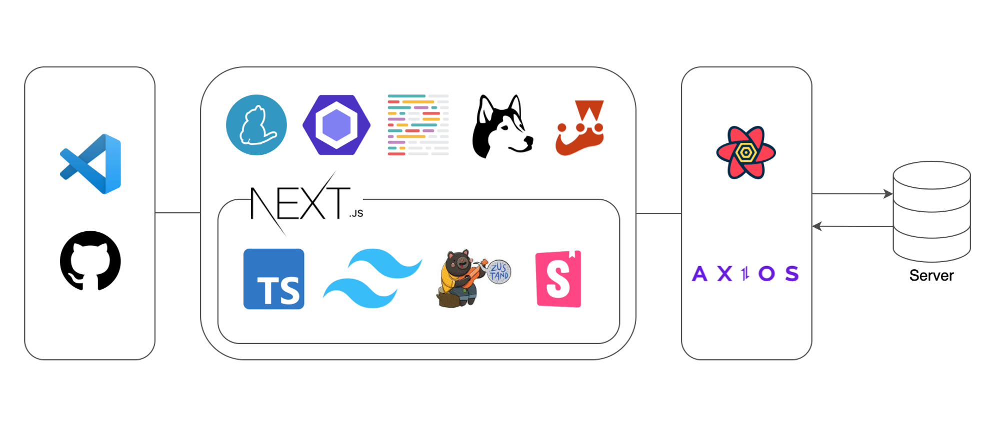

# 돈워리 (DND 10기 3팀)

## 프론트엔드팀 소개

<table>
  <tr>
  <td>
      <a href="https://github.com/CodyMan0">
          	
        </a>
    </td>
    <td>
      <a href="https://github.com/jhsung23">
            
        </a>
    </td>
  </tr>
  <tr>
    <td><b>이주영</b></td>
    <td><b>성지현</b></td>
  </tr>
</table>

## 배포 URL

- **서비스 임시 배포 URL**: https://dontworry-3th.vercel.app/test
- **Storybook 배포 URL**: https://65abd47d09661c4e79c3c260-hnnhgamhoo.chromatic.com/

## 개발 환경 설정

```sh
yarn install ## 패키지 설치
yarn run dev # 로컬에서 개발 서버 실행
yarn run storybook # 로컬에서 스토리북 실행
```

## 프로젝트 기술 스택 선정 이유



- **Next.js**
  많은 사용자 유입이 중요한 프로덕트기 때문에 SEO에 유리한 Next.js 채택
- **Typescript**
  협업에 용이하고 휴먼 에러를 사전에 막을 수 있으며 인텔리센스로부터 오는 DX가 상당하다고 생각
- **TailwindCSS**
  빠른 마크업을 바탕으로 디자인 시스템까지 구축하기 위해 채택
- **Zustand**
  사용 경험이 있는 리덕스와 유사한 중앙 집중형 스토어 형태이면서도, 작성해야 하는 코드양과 번들 사이즈가 훨씬 적고 가볍다는 장점
  지금 상황에서는 전역으로 관리할 상태가 많지 않을 것으로 예상되어 1차적으로는 Context API를 사용하고, Context API의 한계가 느껴질 경우 Zustand를 사용하기로 결정
- **Storybook**
  공통 컴포넌트 관리 및 디자이너와의 효율적인 협업(디자인 QA 등)을 위해 도입
- **React-Query**
  개발 팀 모두 사용 경험이 있으며 캐싱을 포함한 효율적인 서버 상태 관리를 위함
- **Axios**
  인터셉터를 사용하기 위함
